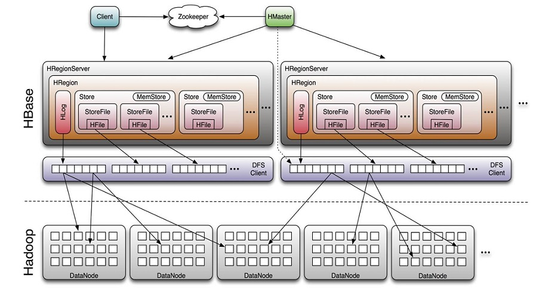

Recently I learnt some materials on HBase, not directly relevant to our work, but good to share any way.   
HBase stands for Hadoop Database. It provides Hadoop what BigTable provides for Google file system. It’s non-relational, column(column family) based and distributed.   
     
A HBase system mainly consists of ZooKeeper, HMaster and HRegionServer.   

   
1. ZooKeeper stores meta data, provides entry point of locating Region, Monitor HRegionServer. Its majority voting mechanism ensures that one single master is alive and there’s no single point of failure.   
2. HMaster manages CRUD operations on data, load balance of HRegionServer, distribution of Region and migration of Region to other HRegionServer.   
3. HRegionServer stores and manage local Region. It’s the core module of HBase which responds to users’ IO request and data interaction with HDFS. Inside a HRegionServer host a number of HRegion, each of which corresponds to a Region and is made of many Stores. Each Store corresponds to a Column Family.   
4.Storefile、Hfile stores binary hadoop file. Storefile is the lightweight wrapper of Hfile.  

## Data Model  

   
The data above, in fact, consists of one single row. The Row Key is the unique identifier of the row. Data is stored by column family (CF1,CF2) and qualifier(qw as in CF1:qw). Roughly column family and qualifier can be understood as two level hierarchical structure. The timestamp gives versions of stored data, in chronological order. Data access, storage and tuning are all managed in the column family level, which hs to be pre-defined, like schema. Like said,  the combination of {row key，column(=<family> +<qualifier>)，version} gives unique data unit.   

## HLog(WAL log)   
A HLog file is a Hadoop Sequence File. Its key is the value of HLogKey, which stores information about stored data. Apart from table and region, this information also contains sequence number and timestamp of writing.   
## Region  
HBase divides tables into horizontal Regions. Each Region stores some consecutive data in a table. Each table starts with one Region. Region grows as new data is inserted and upon some threshold, splits into 2 new Regions.   
Memstore and StoreFile  
One Region is made of multiple Stores, each of which corresponds to a column family.   
A store includes MemStore in RAM and StoreFile in persistent storage. Data is first written into Memstore. When Memstore reaches its capacity, HBase will trigger flashcache action and write the data into a single StoreFile.   
　　　　　　　　　　

　　
## Hbase Read and Write 

   
### Hbase Write  
According to ZooKeeper, the system locates  -ROOT- table, and then .META. table which stores the position of the region. Client then uses this information to access HRegionServer and correspondent Region.  MemStore is the write buffer in RAM. When it reaches its capacity, data would be written into persistent storage. Data in MemStore could be lost in case of server failure.    
WHen the number of StoreFile increases, at some point, the Compaction action will take off, merging multiple StoreFile. It can combine files, clean out dated and redundant data and improve read/write efficiency. There’re Major and Minor Compaction actions.   
### Hbase Read  
After locating region, the system read the MemStore. In case of miss, it goes for BlockCache. If no data found, it will search in persistent storage.   

